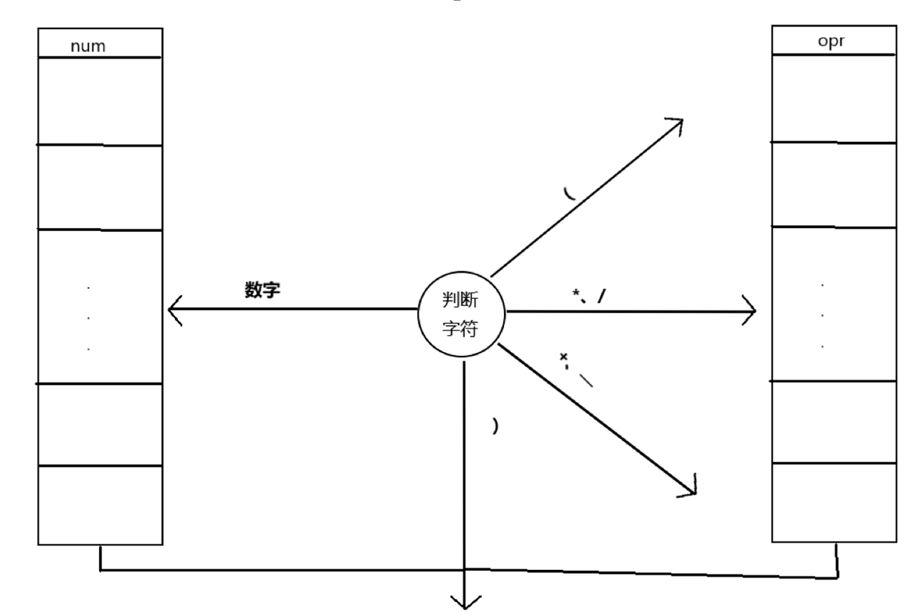

# 利用键盘和1602液晶显示器实现简易计算器
				
## 实验目的

利用矩阵键盘和独立键盘实现一个计算器，计算器必须具备加减乘除功能，并利用1602液晶显示输入的数据和计算结果。

## 实验内容

1、利用矩阵键盘和独立键盘实现一个计算器。

2、能实现小数运算和复数运算，操作符包括’+’、’-’、’*’、’/’、’（’、’）’、’.’、’i’。

3、利用1602液晶显示输入的数据和计算结果。

## 实验器材（设备、元器件）

硬件： TX-1C51单片机、1602液晶

软件： Keil uVision4、STC-ISP-V6.82E

## 实验原理	

1、1602液晶

4脚是数据命令选择端，液晶通过这个引脚来判断接收到的是命令还是数据，该引脚和P3.5连接在一起。当这个引脚是高电平的时候，是数据，当这个引脚是低电平的时候，是命令。

6脚是使能端，该引脚和P3.4连接在一起。当这个引脚出现高脉冲时，液晶读入数据或命令。

2、按键分布

矩阵键盘从左至右、从上到下16个键分别对应计算器的’0’、’1’、’2’、’3’、‘4’、’5’、’6’、’7’、’8’、’9’、’（’、’.’、’+’、’-’、’*’、’/’。独立键盘左边两个键可能影响液晶的工作，不作为计算器的按键；第四个键为计算键，相当于’=’；第三个键为复用键，按下该键后，再按’(’键、’.’键、’=’键，对应计算器的’)’键、’i’键、清屏键。

3.表达式处理

使用两个栈，nums和opr。num分为renums和imnums，分别用于存放的数实部和虚部，opr用于存放操作符。对于实数a，处理时将其扩展为数a+0i；对于虚数bi，处理时将其扩展为数0+bi。

( : 直接加入 opr 中，等待与之匹配的 “)”。

) : 使用现有的 nums 和 opr 进行计算，直到遇到左边最近的一个左括号为止，计算结果放到 nums中。

数字 : 从当前位置开始往后取，将一个连续数字整体取出（包括小数点），判断是实数还是虚数（导致读取数结束的操作符是否是’i’），加入nums中。

*、/：直接加入 opr 中。

+、-：若前一个符号为“+”或“-”或“（”，直接加入opr中，否则使用现有的 num 和 opr 进行计算，直到遇到左边最近的一个上述符号之一为止，计算结果放到 nums中。

值得注意的是，表达式值的计算依赖于数字栈和符号栈中元素的弹出，而表达式中可能出现a-b-c和a/b/c的情况。若是符号全部入栈后进行运算，会先计算b-c和b/c的值，得到的结果实际是a-(b-c)和a/(b/c)的值，为避免这种情况，作出以下补充：

（1）“-”入栈前，先判断上一个符号是否为“-”，若是则先弹出该“-”，计算a-b的值，并将值存入nums中，之后“-”入栈。

（2）“/”入栈前，先判断上一个符号是否为“/”，若是则先弹出该“/”，计算a/b的值，并将值存入nums中，之后“/”入栈。

上述操作确保了符合栈中不会出现连续的“-”或“/”，避免最后从后向前计算表达式时出现a-b-c和a/b/c的情况。

## 算法流程图
 

（PS：由于在实验原理的表达式处理中对各种字符的处理已经进行了详细叙述，相关部分的代码也会有注解，流程图就简略一点吧）

## 实验数据及结果分析

实际效果图如图所示：

 
## 实验结论

利用矩阵键盘和独立键盘实现了一个计算器，该计算器具备加减乘除功能，附加功能有：左右括号运算，小数运算，复数运算。基本完成实验。

## 心得体会

这一次实验加深了我对单片机课程的了解，也让我了解到自己的不足之处。单片机的c语言与c语言虽然几乎完全相同，但也有独特之处。单片机的I/O口资源有限，P3.4和P3.5既作为键盘的I/O口，又与液晶1602的使能端和数据命令选择端相连，在处理键盘扫描时应当注意不要影响到液晶的显示。此外，我还注意到写入单片机的程序所占用的空间资源不能太大，这是因为单片机内存有限，为此我删去了很多不重要的变量，并将栈的元素存储方式由链式结构改为顺序结构，甚至将一个变量用于多种目的（如字符串express用于存储表达式，但经过表达式处理函数deal()后其存储的是表达式的计算结果）。通过本次试验，我加深了对单片机理论知识的理解，了解到如何将理论更好的应用到实践中。 

## 对本实验过程及方法、手段的改进建议

可以附加一些应对非法输入的功能，如除号后出现0时（当符号栈栈顶元素为除号时，判断数字栈栈顶元素是否为0）、左右括号数量不一致时（可以用一个变量记录左右括号数量相减的值，表达式读取完毕后判断该变量的值是否为0）液晶显示ERROR。该计算器未添加上述功能的主要理由是，上述功能的实现需要更多的变量和代码量，计算器及小数、复数和括号运算功能的实现已经占用了大量的空间资源且需要较多的编码量，而单片机RAM有限，且编码量存在上限，不确定是否能支持上述功能的实现。
